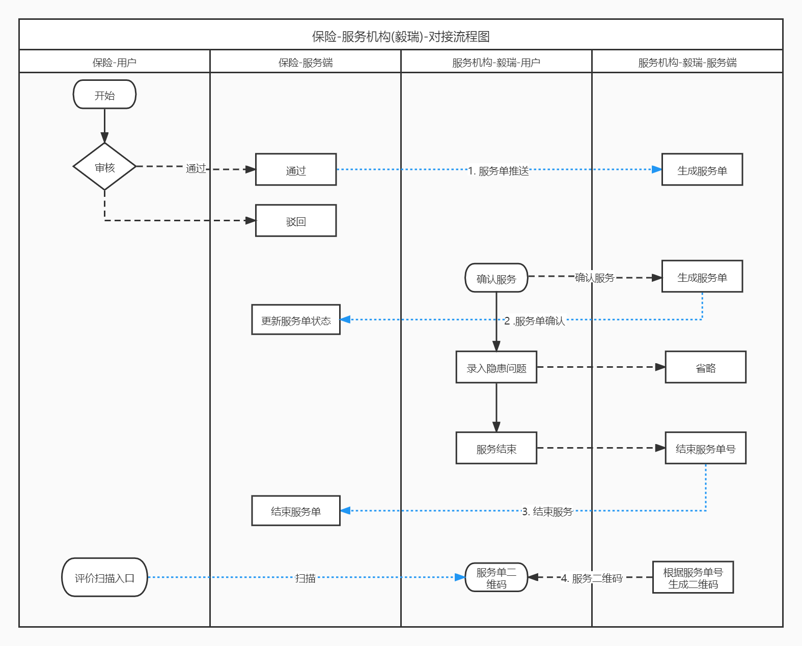

# 现有开发需求-2022-01-26

## 1. 委托保险业务

	1. 委托任务
	2. 委托隐患
	3. 评价二维码
    4. isBim 对接

## 2.复查任务

 	1. 复核任务信息
 	2. 复核流程(含app)

## 3.数据删除

采用逻辑删除.

### 3.1 标记删除

1. 添加 删除标记字段

列表 添加筛选框; 按钮添加 启用/禁用 按钮; 引用页面/模块 (添加**只读**处理, 禁用不可被选中)

	1. 委托方
 	2. 项目
 	3. 设备

### 3.1 级联删除 

1. 检查计划
   1. 删除检查任务

 	2. 检查任务
      	1. 删除 问题 (正确做法, 综合问题, 设备问题)
      	2. 删除 综合评价(模糊评判,打分), 设备评价(模糊评价,打分)
      	3. 删除 签到数据

## 4. 限制重名

1. 委托方名称
2. 项目名称
3. 计划名称

## 5. 检查体系
1. 问题库-问题类型改成 多选
